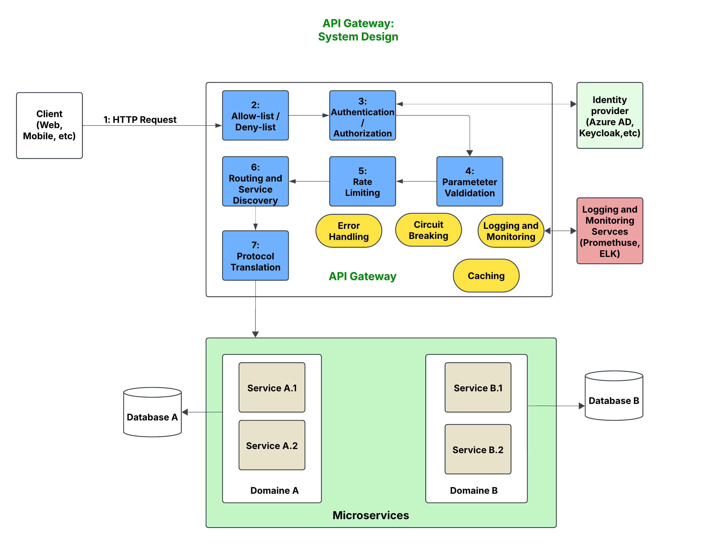

# API Gateway

A lightweight API Gateway built with FastAPI. This gateway serves as a single entry point for client requests, performing authentication (via an external identity provider), dynamic routing to backend services, and handling cross-cutting concerns like rate limiting and error handling.

---

## Design Document

### 3.1 High-Level 
API Gateway Architecture



### 1. Introduction

#### 1.1 Purpose
This document provides a detailed design for an API gateway that will act as the single point of entry for client requests. The gateway will:
- Route requests to various backend services.
- Enforce security and rate limiting policies.
- Perform protocol translation.
- Offer operational insights through logging and monitoring.

#### 1.2 Scope
The design covers:
- Functional requirements.
- Architectural components.
- Data flows.
- Security considerations.
- Deployment strategies.
- Operational monitoring.

### 2. Design Goals and Requirements

#### 2.1 Functional Requirements
- **Single Entry Point:** All client requests (HTTP-based – REST, GraphQL, etc.) are routed through the gateway.
- **Authentication & Authorization:** Validate requests by interfacing with an external identity provider.
- **Rate Limiting & Throttling:** Enforce rate limits based on IP addresses, headers, and authenticated sessions.
- **Routing & Service Discovery:** Dynamically route requests to the appropriate backend services using path-based matching.
- **Protocol Translation:** Transform requests/responses between different protocols (e.g., HTTP to gRPC).
- **Logging & Monitoring:** Capture request/response metrics, errors, and analytics for operational observability.
- **Error Handling & Circuit Breaking:** Protect backend services by gracefully handling errors and preventing overload.
- **Caching:** Cache frequently requested data to reduce load on backend services.

#### 2.2 Non-Functional Requirements
- **Scalability:** Handle high volumes of requests and scale horizontally.
- **Availability:** Deploy in multiple regions to ensure high availability.
- **Security:** Ensure secure communication (TLS), validate inputs, and protect against common web vulnerabilities.
- **Performance:** Minimal added latency during request processing.
- **Extensibility:** Allow new functions or protocols to be added with minimal changes.

### 3. Architecture Overview

#### 3.1 High-Level
- **API Gateway Core:** Receives and validates incoming HTTP requests, initiates authentication, enforces rate limiting, and coordinates routing.
- **Authentication Module:** Integrates with an external identity provider to authenticate requests and retrieve authorization scopes.
- **Rate Limiting Module:** Implements both basic (per IP, headers) and session-based rate limiting.
- **Service Discovery & Routing Module:** Uses a service registry to determine the appropriate backend service based on the request’s path and context.
- **Protocol Transformation Module:** Converts client-facing protocols (HTTP/JSON) to backend protocols (e.g., gRPC) as needed.
- **Error Handling & Circuit Breaking:** Monitors backend service responses to detect failures and triggers circuit breaker logic to avoid overloading services.
- **Logging & Monitoring Module:** Aggregates logs and metrics for performance analysis, analytics, and operational alerts.
- **Caching Layer:** Provides temporary storage of frequently requested data.

### 4. Detailed Component Design

- **API Gateway Core:** Handles incoming client requests, validates request formats, and forwards them for authentication and routing.
- **Authentication & Authorization Module:** Works with external identity providers for token validation.
- **Rate Limiting Module:** Uses in-memory or Redis-based tracking for enforcing request limits.
- **Service Discovery & Routing Module:** Determines backend service routes dynamically.
- **Protocol Transformation Module:** Handles HTTP/JSON to gRPC conversion.
- **Error Handling & Circuit Breaking:** Monitors backend failures and triggers circuit breakers when necessary.
- **Logging & Monitoring Module:** Provides logging, monitoring, and alerting functionalities.
- **Caching Layer:** Optionally stores frequently requested data to optimize performance.

### 5. Data Flow & Sequence
1. Client sends an HTTP request.
2. Gateway validates request structure and performs security checks.
3. Authentication module validates the request token.
4. Rate limiting module applies request limits.
5. Routing module determines backend service destination.
6. Gateway transforms request if necessary and forwards it.
7. Backend service processes request and responds.
8. Gateway transforms response and sends it back to the client.
9. Logging module records transaction details.

### 6. Conclusion
This API Gateway provides secure, scalable, and efficient communication between clients and backend services.

---

## Project Structure

```
api_gateway/
├── app/
│   ├── main.py
│   ├── config.py
│   ├── dependencies.py
│   ├── routers/
│   ├── services/
│   ├── models/
│   ├── utils/
├── tests/
├── requirements.txt
├── Dockerfile
├── readme.md
```

## Prerequisites

- **Python 3.9 or 3.10**
- **Git**
- **Docker** (optional)

## Installation & Setup

```bash
git clone https://github.com/Abdarrahmane-NEINE/api_gateway.git
cd api_gateway
python3 -m venv env
source env/bin/activate
pip install -r requirements.txt
```

## Running the Application

```bash
uvicorn app.main:app --host 0.0.0.0 --port 8000 --reload
```

- Swagger UI: [http://127.0.0.1:8000/docs](http://127.0.0.1:8000/docs)
- ReDoc: [http://127.0.0.1:8000/redoc](http://127.0.0.1:8000/redoc)

## Database Migrations with Alembic

```bash
alembic init alembic
alembic revision --autogenerate -m "Initial migration"
alembic upgrade head
```

## Testing

```bash
pytest --maxfail=1 --disable-warnings -q
```

## Future Enhancements

- Advanced rate limiting and circuit breaking.
- Integration with logging/monitoring tools.
- Support for gRPC.
- Enhanced service discovery mechanisms.
- Expanded authorization features.

---

This API Gateway is designed to be a scalable, secure, and high-performance entry point for client requests.

